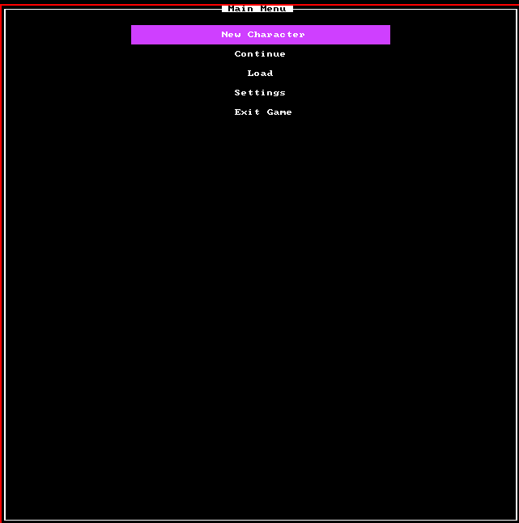

# Rogue Adventure

### Explanation
A concept game developed in C++ and Libtcod for programming practice in my spare time. 
Not very much fun, but still kinda cool in my opinion. Hopefully I'll make an actual fun game some day :sweat_smile:.

Heavily developed using this tutorial [Libtcod C++ Roguelike Tutorial](http://www.roguebasin.com/index.php?title=Complete_roguelike_tutorial_using_C%2B%2B_and_libtcod_-_part_1:_setting_up). Although there were some pretty outdated parts of that that I tried to adapt to be as modern as possible (smart pointers, RAII, etc).

  

### Controls:
- 'w a s d' = Game and Menu movement
- 'return' = Menu actions/pressing and select item in inventory
- 'esc' = Menu / Go back up a menu stack
- Walk into enemies to attack them
- Mouse for observing objects and targeting with selected items
- 'g' = Pick up item
- 'i' = Open inventory
- 'z' = Open drop inventory (same as inventory but just drops items instead)
- 'i' = Open inventory

The "objective" is to around explore the one floor there is, and kill all the green trolls. Yellow "friendly dudes", while they
do attack you, deal zero damage, so by technicality they are friendly. Really they're the best friends you'll have in this game.

### Why this game is awesome
- Mostly just pure C++. 
- Uses Libtcod for rendering tiles and raycasting shadows only.
- Reimplementation of the tutorial (diverges from it a bunch) in order to make it.
  more modernized and memory managed. Yay smart pointers!

### Why this game is not awesome
- No story or direction whatsoever.
- Turns out designing a good GUI is not a trivial task :grimacing:.
- Not a lot of comments. Wished I used Doxygen or some documentation scheme from the get-go.
- No linting. I also wished I used linting from the get-go.
